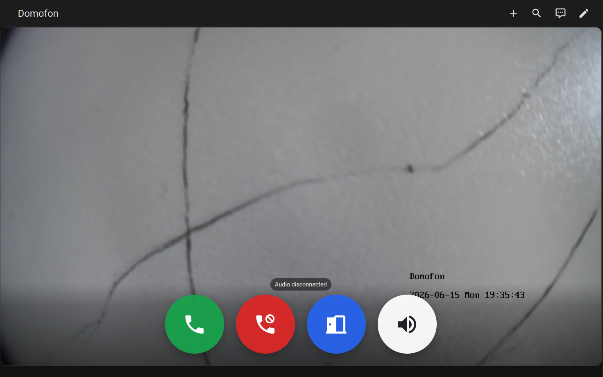
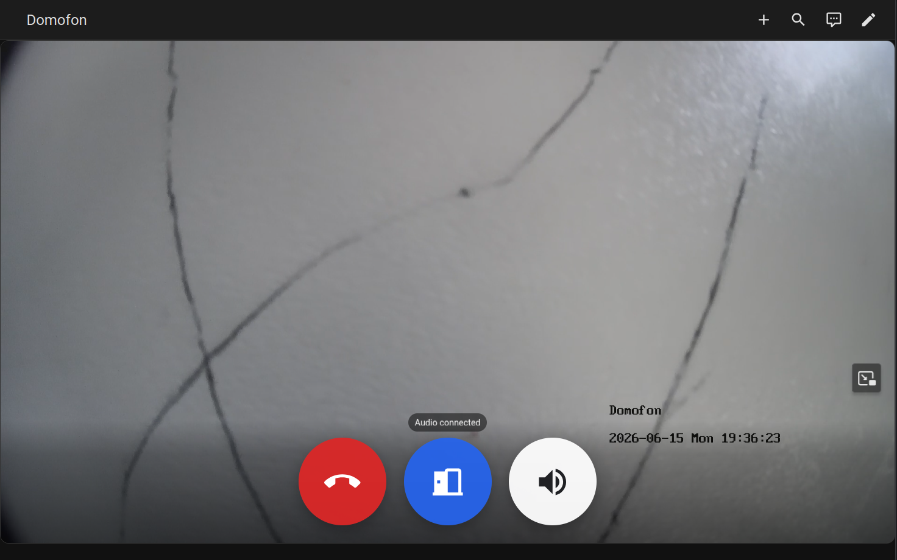

# SIP Indoor Station Card

<p align="center">
  
</p>

<p align="center">
  <a href="https://my.home-assistant.io/redirect/hacs_repository/?owner=arturzx&repository=sip-indoor-station-card&category=plugin">
    
  </a>
</p>

Home Assistant Lovelace custom card for SIP Indoor Station.

This card wraps `advanced-camera-card` for video, adds microphone support through WebRTC and controls for the entities exposed by the SIP Indoor Station integration.

## Requirements

- [SIP Indoor Station add-on](https://github.com/arturzx/hass-addons/tree/master/sip_indoor_station)
- [SIP Indoor Station integration](https://github.com/arturzx/sip-indoor-station-integration)
- [Advanced Camera Card](https://github.com/dermotduffy/advanced-camera-card)
- HTTPS accessible Home Assistant. Without this card won't receive access to the microphone.

## Screenshots

<p align="center">
  <strong>Ringing</strong>
  <br>
  
  <br>
  <strong>Answered</strong>
  <br>
  
</p>

## Installation

### HACS (Recommended)

Install this repository in HACS as a dashboard plugin:

<a href="https://my.home-assistant.io/redirect/hacs_repository/?owner=arturzx&repository=sip-indoor-station-card&category=plugin">

</a>

HACS downloads `sip-indoor-station-card.js` and registers it as a Home Assistant dashboard resource.

### Manual

Copy `sip-indoor-station-card.js` to:

```text
config/www/sip-indoor-station-card.js
```

Then add it as a Home Assistant dashboard resource:

```yaml
url: /local/sip-indoor-station-card.js
type: module
```

## Configuration

```yaml
type: custom:sip-indoor-station-card
entity_prefix: door_station
camera: camera.front_door
device: door_station
```

`camera` can also be a single `advanced-camera-card` camera object:

```yaml
type: custom:sip-indoor-station-card
entity_prefix: door_station
camera:
  camera_entity: camera.front_door
  live_provider: auto
device: door_station
```

For multiple cameras, use `advanced-camera-card` style directly:

```yaml
type: custom:sip-indoor-station-card
entity_prefix: door_station
cameras:
  - camera_entity: camera.front_door
  - camera_entity: camera.side_door
device: door_station
```

The `device` option selects the integration entity name prefix for a door station. It is an alias for `entity_prefix`, so this:

```yaml
type: custom:sip-indoor-station-card
camera: camera.front_door
device: door_station
```

uses the same entities as `entity_prefix: door_station`.

The `entity_prefix` value defaults to `door_station` and is used to find integration entities:

- `binary_sensor.door_station_registered`
- `binary_sensor.door_station_ringing`
- `binary_sensor.door_station_in_call`
- `sensor.door_station_call_state`
- `button.door_station_answer`
- `button.door_station_reject`
- `button.door_station_hang_up`
- `button.door_station_open_door`

If you renamed entities manually, you can still override individual entities:

```yaml
type: custom:sip-indoor-station-card
entity_prefix: door_station
camera: camera.front_door
device: door_station
answer_button: button.my_answer_button
open_door_button: button.my_open_door_button
```

To show the do-not-disturb control, set `do_not_disturb_entity` to a toggle entity. Use a `switch` entity or an `input_boolean` helper:

```yaml
type: custom:sip-indoor-station-card
camera: camera.front_door
device: door_station
do_not_disturb_entity: input_boolean.door_station_do_not_disturb
```

For a custom `advanced-camera-card` configuration, pass it through:

```yaml
type: custom:sip-indoor-station-card
camera: camera.front_door
advanced_camera_card:
  type: custom:advanced-camera-card
  cameras:
    - camera_entity: camera.front_door
      live_provider: go2rtc
```
